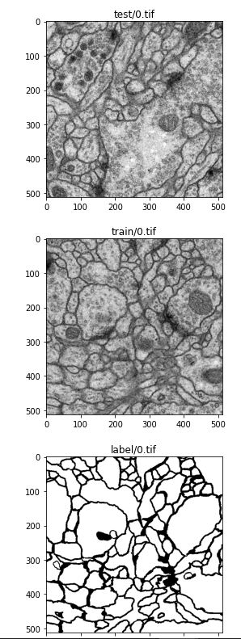
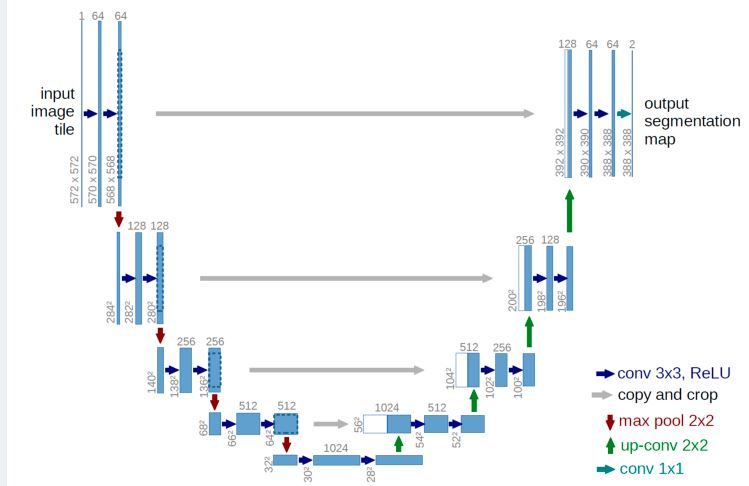
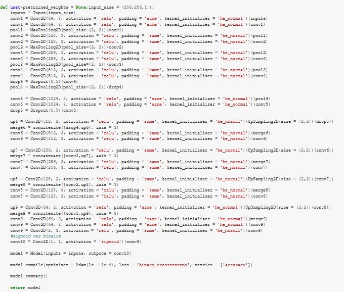

# Segmentation des Images de la Microscopie Electronique

L’IA permet de simplifier et d’accélérer le travail des équipes d’imagerie, aujourd’hui majoritairement sur les étapes précliniques, en facilitant la lecture des images. Le CHRU a donc besoin d'un outil IA pour segmenter un tel type d'images. Il vous demande de l'aide pour cet objectif.

# Contexte du projet

L’IA est aujourd’hui omniprésente dans la littérature scientifique de l’imagerie médicale, d’autant plus depuis le développement de nouveaux algorithmes appelés réseaux de neurones convolutifs

En effet, à ce jour, l’IA est très utile dans le domaine de l’imagerie, sur deux volets : la classification des images et la segmentation des organes. Les algorithmes pour classifier les images peuvent permettre d’aider au diagnostic en classant une image dans une catégorie particulière de pathologie. Les algorithmes pour segmenter les images sont couramment utilisés sur tous les types d’imagerie et en routine au CHRU. C’est ainsi que l’IA permet un gain de temps aux praticiens à la fois pour le diagnostic ou lors d’interventions. Elle présente aussi l’avantage de contourner certains biais liés à l’interprétation de l’opérateur.

# Segmentation d'images

Lorsqu'un seul objet est présent dans une image, nous utilisons une technique de localisation d'image pour dessiner un cadre de délimitation autour de cet objet. Dans le cas de la détection d'objet, il fournit des étiquettes avec les cadres de délimitation; par conséquent, nous pouvons prédire l'emplacement ainsi que la classe à laquelle appartient chaque objet.

La segmentation d'image donne des informations plus granulaires sur la forme d'une image et donc une extension du concept de détection d'objet.

Nous segmentons, c'est-à-dire divisons les images en régions de couleurs différentes, ce qui aide à distinguer un objet de l'autre à un niveau plus fin

# Transformer les images .tiff en .png

Le format TIFF est un format raster qui signifie : Tagged Image File Format. Ce format est principalement utilisé en PAO et en photographie.Le format est conçu pour maintenir l’intégrité du contenu du fichier lors de la compression, sans en sacrifier la qualité.

"pourquoi convertir les images tiff en png"?

Ces deux formats sont des fichiers graphiques matriciels à compression sans perte, mais la conversion au format PNG permet d'obtenir une taille de fichier plus facile à gérer .

# Jeu de données

Le jeu de données correspond à des images de drosophiles.

Une drosophile est un Insecte de l'ordre des Diptères, surnommée « mouche du vinaigre ». Le genre Drosophila comporte environ 400 espèces, retrouvées sur l'ensemble du globe. Vie de la drosophile

Elles atteignent une longueur de 1 à 2 millimètres. Les drosophiles sont attirées par les fruits, dans lesquels elles pondent leurs œufs et où les larves se développent. Elles possèdent la propriété de se multiplier très rapidement et en très grand nombre. Drosophila melanogaster

La drosophile la plus connue est certainement Drosophila melanogaster, qui est l'un des organismes modèles des biologistes, et plus particulièrement en génétique. Son génome est entièrement séquencé et comporte 4 paires de chromosomes, soit 165 millions de paires de bases.

"Les données sont un ensemble de 30 sections d'une section série de données de microscopie électronique à transmission (ssTEM) du cordon nerveux ventral de la larve du premier stade de la drosophile (VNC)"

Nous disposons de 30 images test, train et label 512*512 ce qui n'est pas suffisant pour alimenter un réseau de neurones d'apprentissage en profondeur, nous allons donc procéder à la data augmentation pour y remédier.

Le module appelé ``ImageDataGenerator dans keras.preprocessing.image`` sera utiliser pour augmenter les données.

Le projet est réalisé sur Google Colab.

# Data augmentation

L’entraînement d’un réseau de neurones profond sur très peu d’images est souvent challengeant : le modèle n’ayant accès qu’à un nombre limité d’observations, il va avoir tendance à faire de “l’overfitting”, c’est à dire sur-apprendre à partir de l’échantillon d’entraînement, sans pour autant être capable d’émettre des prédictions pertinentes sur de nouvelles images – dans ce cas les performances sont faibles sur l’échantillon de test alors qu’elles étaient bonnes sur les images d’entraînement.

Ce phénomène est bien connu des Data Scientists, qui le résolvent souvent en augmentant la taille du dataset et/ou réduisant le nombre de paramètres du modèle.

La première méthode est souvent difficile à mettre en place car le travail de recueil/labellisation de nouvelles observations est laborieux.

La seconde possibilité est envisageable pour un problème de reconnaissance d’images, cependant les modèles même les moins complexes peuvent contenir des centaines de milliers de paramètres, donc difficile à réaliser ! Comme la Data Augmentation permet de générer de nouvelles images labellisées à partir de celles déjà disponibles, c’est une solution relativement facile à mettre en place, et les résultats peuvent être surprenants.

# Architecture utilisée dans le modèle

Le U-Net est une architecture à réseau convolutionnel pour une segmentation rapide et précise des images. Il a la particularité d’avoir une architecture symétrique composée d’une partie de “contraction”, qui va permettre de détecter le contexte et les objets, et une partie “expansion” composée de succession d’up-convolution qui fait le chemin inverse qui va permettre de reconstituer l’image composée de macro-features extraites de la partie “contraction” et finalement de localiser précisément le contour des objets détectés.

Il a une forme en «U».

L'architecture U-Net est symétrique et son fonctionnement est un peu similaire aux encodeurs automatiques. Il peut être réduit en trois parties principales:

    le chemin de contraction (sous-échantillonnage),
    le goulot d'étranglement
    le chemin d'expansion (de suréchantillonnage).

Dans les auto-codeurs, la partie codeur du réseau neuronal comprime l'entrée dans une représentation d'espace latent, puis un décodeur construit la sortie à partir de la représentation compressée ou codée. Mais il y a une légère différence, contrairement aux structures codeur-décodeur régulières, les deux parties ne sont pas découplées. Les connexions par sauts sont utilisées pour transférer des informations à granularité fine des couches de bas niveau du chemin d'analyse vers les couches de haut niveau du chemin de synthèse, car ces informations sont nécessaires pour générer des reconstructions qui ont des détails précis.

# Modèle

# Résultats

